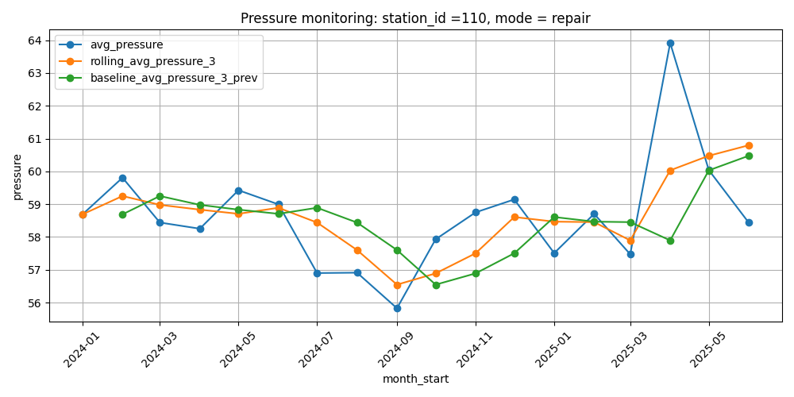
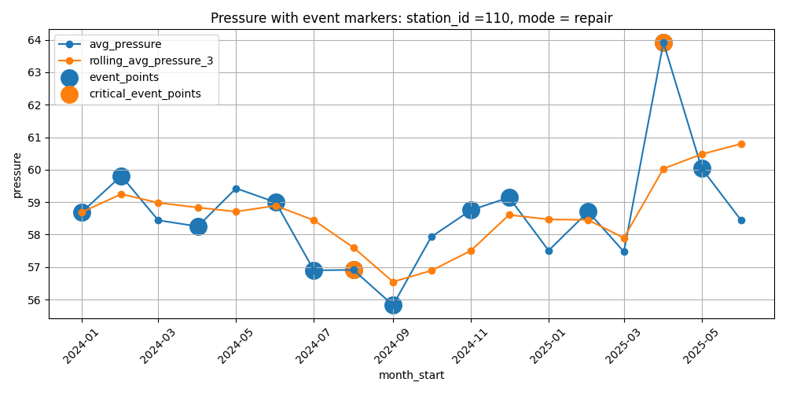

# Monitoring and Stability Analysis of Compressor Stations

## Project Overview

This project builds an analytical monitoring pipeline for compressor stations using synthetic operational data. The goal is to detect unstable operating periods, compare current behavior with previous and rolling baselines, connect monitoring signals with operational events, and validate the same logic across SQL and pandas.

The project is designed as a portfolio-style analytics case that demonstrates:

- SQL-based analytical mart development;
- time-series feature engineering with window functions;
- event-aware monitoring logic;
- pandas reproduction of SQL logic;
- SQL vs pandas validation;
- matplotlib-based visual analysis;
- an exploratory machine learning extension for next-month event prediction.

The dataset is synthetic, but it follows a realistic operational structure: compressor stations, daily measurements, operating modes, and event logs.

## Business Problem

Compressor stations generate regular operational measurements such as pressure, flow, temperature, and vibration. A monitoring process should identify periods where station behavior deviates from recent historical patterns and determine whether these deviations are connected with operational events.

The analytical questions behind the project are:

- Which stations and operating modes show unstable behavior?
- Are current pressure and flow values significantly different from previous or rolling baselines?
- Which monitoring signals are most common?
- Do warning/anomaly periods overlap with operational events?
- Which stations or modes should be prioritized for further investigation?

## Dataset

The project uses three raw CSV files:

| File | Description |
|---|---|
| `stations.csv` | Compressor station metadata |
| `measurements.csv` | Daily operational measurements |
| `events.csv` | Operational events and severity levels |

Dataset summary:

| Metric | Value |
|---|---:|
| Stations | 12 |
| Measurement rows | 6,564 |
| Event rows | 106 |
| Date range | 2024-01-01 to 2025-06-30 |
| Period length | 18 months |
| Operating modes | normal, peak, stress, repair |
| Intentionally unstable stations | 104, 110 |
| Relatively stable stations | 102, 107, 111 |

More details are available in:

- `DATASET_NOTES.md`
- `DATA_DICTIONARY.md`
- `dataset_summary.json`

## Project Workflow

The project follows this workflow:

1. Create PostgreSQL tables for stations, measurements, and events.
2. Load raw CSV files into the database.
3. Build monthly station-mode metrics from daily measurements.
4. Add previous-period, rolling, and baseline features using SQL window functions.
5. Calculate percentage changes and deviations from rolling/baseline values.
6. Create monitoring flags and a final monitoring status.
7. Join monthly monitoring results with station-level event data.
8. Run analysis queries and threshold diagnostics.
9. Reproduce the same monitoring logic in pandas.
10. Validate pandas results against the SQL mart.
11. Build visual checks in matplotlib.
12. Add a lightweight ML extension for next-month event prediction.

## SQL Monitoring Mart

The main SQL layer is built at the following grain:

```text
one row = one month_start + one station_id + one mode
```

The final processed monitoring dataset contains 845 rows and 51 columns.

The SQL mart includes:

- monthly average pressure, flow, temperature, and vibration;
- observation count;
- previous-period values with `LAG()`;
- 3-period rolling averages;
- 3-period previous-only baselines;
- absolute and percentage changes;
- deviations from rolling values;
- deviations from previous-only baselines;
- binary monitoring flags;
- total `signal_count`;
- final `monitoring_status`.

Monitoring status logic:

| Condition | Status |
|---|---|
| `signal_count = 0` | stable |
| `signal_count = 1` | warning |
| `signal_count IN (2, 3)` | anomaly |
| `signal_count >= 4` | critical |

Main SQL files:

| File | Purpose |
|---|---|
| `sql/01_schema.sql` | Creates source tables |
| `sql/02_load_data.sql` | Loads raw CSV files |
| `sql/03_monthly_metrics.sql` | Builds monthly station-mode metrics |
| `sql/04_monitoring_core.sql` | Builds the core monitoring mart |
| `sql/05_monitoring_with_events.sql` | Adds event-aware monitoring features |
| `sql/06_analysis_queries.sql` | Contains analytical queries over the final mart |
| `sql/07_threshold_diagnostics.sql` | Checks threshold behavior and signal distribution |
| `sql/08_ml_ready.sql` | Builds station-month data for the ML extension |

## Event-Aware Monitoring Layer

Operational events are aggregated at station-month level and joined to the monitoring mart.

Event-aware features include:

- `event_count`;
- `critical_event_count`;
- `avg_event_duration`;
- `has_events`;
- `has_critical_events`;
- `problematic_with_events`;
- `anomaly_or_critical_with_events`.

This layer helps separate pure metric deviations from deviations that overlap with real operational events.

## Pandas Reproduction and SQL Validation

The SQL monitoring logic was reproduced in pandas using:

- `groupby()` and `agg()` for monthly metrics;
- `groupby().shift()` for previous-period features;
- `groupby().transform()` with `rolling()` for rolling and baseline metrics;
- vectorized calculations for changes and flags;
- `merge()` for event-aware enrichment;
- `np.select()` for monitoring status logic.

The pandas result was compared with the exported SQL mart using a validation workflow:

1. Merge pandas and SQL outputs by `month_start`, `station_id`, and `mode`.
2. Compare numerical columns using `np.isclose()`.
3. Compare categorical and binary columns directly.
4. Build automatic `*_check` columns.
5. Create final `is_match` flag.
6. Isolate mismatches into `mismatch_df`.

Validation result:

| Check | Result |
|---|---:|
| Rows matched between pandas and SQL | 845 |
| Left-only rows | 0 |
| Right-only rows | 0 |
| Mismatch rows | 0 |

This confirms that the pandas reproduction matches the SQL monitoring mart.

## Visual Analysis

The project includes matplotlib-based visual checks for selected station-mode slices.

### Problematic slice: station 110, repair mode

The first visual check compares pressure behavior with rolling and baseline values for a problematic station-mode slice.



The next chart highlights anomaly points for station 110.


The event-aware chart adds operational event markers to the monitoring view.



### Stable slice: station 102, normal mode

The stable slice is used as a comparison case where pressure and flow remain close to expected behavior.


## Key Findings

### 1. Most station-mode months were stable

The final monitoring mart shows that most observations were classified as stable.

| Monitoring status | Row count |
|---|---:|
| stable | 824 |
| warning | 17 |
| anomaly | 4 |
| critical | 0 |

This means the monitoring logic is selective rather than over-triggering alerts.

### 2. Flow-based signals were the main source of alerts

Signal distribution:

| Signal | Count |
|---|---:|
| Large flow shift vs previous month | 18 |
| Flow anomaly vs previous baseline | 4 |
| Large flow shift vs rolling average | 3 |
| Large pressure shift vs previous month | 2 |
| Large pressure shift vs rolling average | 0 |
| Pressure anomaly vs previous baseline | 0 |

The most sensitive part of the monitoring logic was related to flow changes rather than pressure anomalies.

### 3. Repair mode had the highest event-overlap rate

Rows where monitoring signals overlapped with events were concentrated mostly in repair mode.

| Mode | Problematic rows with events | Total rows | Rate |
|---|---:|---:|---:|
| repair | 8 | 198 | 4.04% |
| normal | 1 | 216 | 0.46% |
| stress | 1 | 216 | 0.46% |
| peak | 0 | 215 | 0.00% |

This makes repair mode the most important operating mode for event-aware monitoring in this dataset.

### 4. Station 110 concentrated the strongest problematic patterns

Station 110 appeared in the top anomaly/event overlaps and had the highest number of critical events at the station-month level.

| Station | Critical events |
|---|---:|
| 110 | 3 |
| 103 | 1 |

The strongest anomaly/event overlaps were found for station 110 in `normal` and `repair` modes.

### 5. Events and monitoring signals partly overlap, but not perfectly

Event and signal overlap summary at the enriched monitoring-row level:

| Metric | Count |
|---|---:|
| Rows with events | 313 |
| Rows with monitoring signals | 21 |
| Rows with both signals and events | 10 |
| Rows with anomaly/critical status | 4 |
| Rows with anomaly/critical status and events | 2 |

This indicates that event data and monitoring signals provide related but not identical perspectives. Some events happen without strong metric deviations, and some metric deviations happen without recorded events.

## ML Extension

The ML part is an additional exploratory layer, not the core of the project.

The SQL file `sql/08_ml_ready.sql` builds a station-month dataset for next-month event prediction.

ML setup:

| Component | Description |
|---|---|
| Grain | one row = one month_start + one station_id |
| Target | `has_events_next_month` |
| Model | Logistic Regression |
| Baseline improvement | `class_weight="balanced"` was used to improve recall |
| Main goal | demonstrate how analytical monitoring features can be reused for a simple predictive task |

The ML extension uses monitoring features such as:

- current monthly averages;
- previous-period values;
- rolling averages;
- previous-only baselines;
- percentage changes;
- monitoring flags;
- `signal_count`.

The main interpretation is that ML can be added as a second layer after a transparent rule-based monitoring system. In this project, the rule-based analytical mart remains the primary result.

## Project Structure

```text
compressor-station-stability-analysis/
│
├── README.md
├── DATASET_NOTES.md
├── DATA_DICTIONARY.md
├── dataset_summary.json
│
├── data/
│   ├── raw/
│   │   ├── stations.csv
│   │   ├── measurements.csv
│   │   └── events.csv
│   │
│   └── processed/
│       ├── monitoring_sql.csv
│       └── ml_ready.csv
│
├── reports/
│   ├── anomaly pressure station 110.png
│   ├── event_markers_station_110.png
│   ├── pressure_station_110_repair.png
│   ├── stable flow 102 station, normal.png
│   └── stable pressure 102 normal.png
│
├── sql/
│   ├── 01_schema.sql
│   ├── 02_load_data.sql
│   ├── 02_load_notes.sql
│   ├── 03_monthly_metrics.sql
│   ├── 04_monitoring_core.sql
│   ├── 05_monitoring_with_events.sql
│   ├── 06_analysis_queries.sql
│   ├── 07_threshold_diagnostics.sql
│   └── 08_ml_ready.sql
│
└── src/
    ├── monitoring_validation_and_plots.py
    └── ml_baseline.py
```

## Technologies Used

- PostgreSQL
- SQL CTEs
- SQL window functions
- pandas
- NumPy
- matplotlib
- scikit-learn
- Git / GitHub

## How to Run

### 1. Create database tables

Run:

```sql
sql/01_schema.sql
```

### 2. Load raw data

Update local paths in `sql/02_load_data.sql`, then run the load script.

Raw files are located in:

```text
data/raw/stations.csv
data/raw/measurements.csv
data/raw/events.csv
```

### 3. Build SQL monitoring outputs

Run SQL files in order:

```text
sql/03_monthly_metrics.sql
sql/04_monitoring_core.sql
sql/05_monitoring_with_events.sql
sql/06_analysis_queries.sql
sql/07_threshold_diagnostics.sql
```

Export the final monitoring result to:

```text
data/processed/monitoring_sql.csv
```

### 4. Run pandas validation and plots

Run:

```bash
python src/monitoring_validation_and_plots.py
```

### 5. Run ML extension

Run:

```bash
python src/ml_baseline.py
```

## Future Improvements

Potential next steps:

- convert the monitoring mart into a reusable SQL view or materialized view;
- parameterize monitoring thresholds;
- save plots automatically to `reports/`;
- add a dashboard layer in Power BI, Tableau, or Streamlit;
- improve ML preprocessing with scaling and time-based validation;
- compare Logistic Regression with tree-based models;
- add station-level risk scoring;
- add automated data quality checks;
- package SQL and pandas validation as a repeatable pipeline.

## Project Status

Current status: core analytical project completed.

Completed layers:

- SQL schema and data loading;
- SQL monitoring mart;
- event-aware monitoring layer;
- analysis queries;
- threshold diagnostics;
- pandas reproduction;
- SQL vs pandas validation;
- matplotlib visual checks;
- exploratory ML extension.

The strongest part of the project is the end-to-end analytical pipeline:

```text
raw operational data
→ SQL monitoring mart
→ event-aware analysis
→ pandas reproduction
→ validation
→ visualization
→ lightweight ML extension
```
